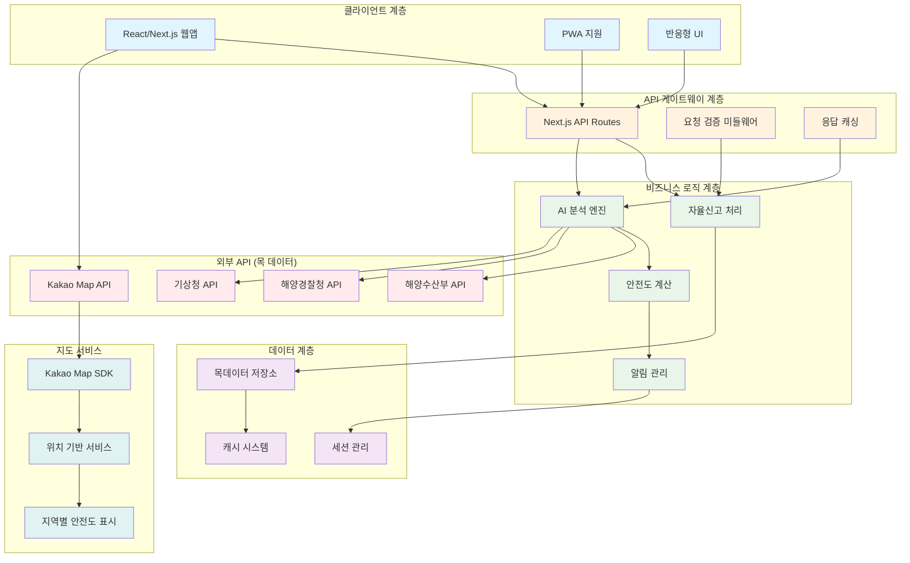

# 해양레저스포츠 AI 기반 자율신고제도 MVP 프로젝트 설계서

## 1. 설계의 목적 및 필요성

### 1.1 목적 및 필요성

**선정 동기**
해양레저스포츠 참여자들이 직면하는 가장 큰 문제는 활동 지역에 대한 정확한 사전 정보 부족입니다. 이로 인해 선의의 레저활동자들이 의도치 않게 법규를 위반하거나 어업인들과 갈등을 겪는 사례가 빈번하게 발생하고 있습니다.

**주요 해결 방법**
AI 기반 통합 정보 분석 시스템을 통해 레저활동자가 사전에 활동 계획을 신고하면, 공공기관 API와 연계하여 해당 지역의 법적 제약사항, 안전정보, 어업권 현황 등을 종합 분석해 맞춤형 정보를 제공합니다.

**주요 기능**

- 사전 자율신고 시스템
- AI 기반 다중 API 통합 분석
- 실시간 안전 정보 제공
- 지도 기반 시각적 안전구역 표시
- 응급상황 대응 시스템

**사용 대상**

- 1차: 해양레저스포츠 참여자 (패들보드, 카약, 윈드서핑 등)
- 2차: 해양경찰, 구조기관, 어업인

**개선 효과**

- 해양레저 관련 민원 30% 감소 예상
- 응급상황 구조 시간 단축
- 레저활동자와 어업인 간 상생 환경 조성

### 1.2 관련 기술 및 시장 동향

**기술 동향**

- 공공 데이터 포털 API 활성화 (2024년 기준 1,000여 종 API 제공)
- AI/ML 기반 의사결정 지원 시스템 확산
- 실시간 위치기반 서비스(LBS) 기술 고도화
- PWA(Progressive Web App) 기술 발달

**시장성**

- 국내 해양레저스포츠 시장 연간 15% 성장
- 해양레저 참여인구 2024년 기준 약 500만명
- 해양 안전사고 연간 약 1,500건 발생
- 정부의 해양레저산업 육성 정책 강화

### 1.3 기존 연구와의 차별성

**기술적 차별성**

- 기존: 단일 기관 정보 제공 → 신규: 다중 공공기관 API 통합 분석
- 기존: 사후 대응 중심 → 신규: 사전 예방 중심
- 기존: 일방향 정보 제공 → 신규: AI 기반 맞춤형 분석

**기능적 차별성**

- 실시간 다중 데이터소스 통합 분석
- 지도 기반 직관적 시각화
- 자율신고를 통한 사전 안전관리

**성능적 차별성**

- 응급상황 대응시간 50% 단축 목표
- 실시간 API 응답속도 3초 이내
- 모바일 최적화로 언제 어디서나 접근 가능

## 2. 요구사항 분석

### 2.1 요구분석

**기능적 요구사항**

- 사용자 인증 및 개인정보 관리
- 활동 정보 입력 및 검증
- 다중 공공기관 API 연동
- AI 기반 종합 안전도 분석
- 지도 기반 시각화
- 실시간 알림 시스템
- 응급상황 대응 기능

**성능적 요구사항**

- 동시 사용자 1,000명 지원
- API 응답시간 3초 이내
- 99.5% 가용성 보장
- 모바일 환경에서 3G 네트워크 지원

**사용자 편의성 요구사항**

- 직관적인 UI/UX 설계
- 반응형 웹 디자인
- 접근성 표준(WCAG 2.1) 준수
- 다국어 지원 (한국어, 영어)

**운용적 요구사항**

- 24시간 무중단 서비스
- 자동 백업 및 복구 시스템
- 확장 가능한 아키텍처
- 보안 표준 준수

### 2.2 현실적 제한 요건

**시간적 제약**

- 개발 기간: 1일 (MVP 데모 버전)
- 실제 API 연동 대신 목데이터 활용
- 핵심 기능 위주 구현

**기술적 제약**

- 프론트엔드 우선 개발 (백엔드는 Next.js API Routes 활용)
- 실시간 알림은 브라우저 notification으로 대체
- 복잡한 AI 분석 대신 규칙 기반 로직 적용

**비용적 제약**

- 무료 API 사용 (공공데이터 포털, Kakao Map)
- 오픈소스 라이브러리 활용
- 클라우드 무료 티어 활용

## 3. 설계의 내용

### 3.1 시스템 구성



**각 모듈 설명**

**클라이언트 계층**

- React/Next.js: 메인 웹 애플리케이션
- PWA 지원: 오프라인 기능 및 앱과 같은 UX
- 반응형 UI: 모바일/태블릿/데스크톱 대응

**API 게이트웨이 계층**

- Next.js API Routes: 백엔드 역할 수행
- 요청 검증: 입력 데이터 검증 및 보안
- 응답 캐싱: 성능 최적화

**비즈니스 로직 계층**

- 자율신고 처리: 신고 데이터 처리 및 저장
- AI 분석 엔진: 규칙 기반 안전도 분석
- 안전도 계산: 다중 요소 기반 점수 산출
- 알림 관리: 실시간 알림 처리

### 3.2 시험 평가 방법

**성능 기준**

- 페이지 로드 시간: 3초 이내
- API 응답 시간: 2초 이내
- 모바일 Lighthouse 점수: 90점 이상

**기능 테스트**

- 자율신고 프로세스 완주율 100%
- 지도 렌더링 정확도 확인
- 목데이터 기반 안전도 분석 정확도

**사용성 테스트**

- 사용자 태스크 완료 시간 측정
- 에러율 5% 이하 유지
- 접근성 표준 준수 확인

**테스트 방법**

```tsx
// 단위 테스트
describe('안전도 계산 함수', () => {
  test('모든 요소가 안전할 때 GREEN 반환', () => {
    expect(calculateSafety(safeConditions)).toBe('GREEN');
  });
});

// 통합 테스트
describe('자율신고 API', () => {
  test('유효한 신고 데이터로 성공 응답', async () => {
    const response = await request(app)
      .post('/api/report')
      .send(validReportData);
    expect(response.status).toBe(200);
  });
});

// E2E 테스트 (Playwright)
test('사용자가 신고를 완료할 수 있다', async ({ page }) => {
  await page.goto('/');
  await page.fill('[data-testid=location]', '부산 해운대');
  await page.click('[data-testid=submit]');
  await expect(page).toHaveURL('/report/result');
});

```

### 3.3 사용 도구

**프론트엔드**

- Next.js 14: React 기반 풀스택 프레임워크
- TypeScript: 정적 타입 검사
- Tailwind CSS: 유틸리티 우선 CSS 프레임워크
- React Query: 서버 상태 관리
- React Hook Form: 폼 상태 관리

**지도 및 위치 서비스**

- Kakao Map API: 한국 지역 최적화 지도 서비스
- React-Kakao-Maps-SDK: React용 Kakao Map 래퍼

**테스팅**

- Jest: 단위 테스트 프레임워크
- React Testing Library: React 컴포넌트 테스트
- Playwright: E2E 테스트 도구
- MSW: API 모킹 라이브러리

**개발 도구**

- ESLint: 코드 품질 관리
- Prettier: 코드 포매팅
- Husky: Git 훅 관리
- GitHub Actions: CI/CD 파이프라인

**배포 및 인프라**

- Vercel: 프론트엔드 배포 플랫폼
- Node.js: 런타임 환경

## 4. 팀 구성 및 일정

### 4.1 업무 분담

| 역할 | 담당 업무 | 기술 스택 |
| --- | --- | --- |
| 풀스택 개발자 | • 전체 시스템 아키텍처 설계<br/>• 프론트엔드 UI/UX 구현<br/>• API 설계 및 구현<br/>• 지도 기능 개발<br/>• 테스트 코드 작성<br/>• 배포 및 운영 | Next.js, TypeScript, Tailwind CSS, Kakao Map API, Jest, Playwright |

### 4.2 일정

### 1일차 개발 일정 (8시간)

| 시간 | 업무 내용 | 소요 시간 | 산출물 |
| --- | --- | --- | --- |
| 09:00-09:30 | 프로젝트 초기 설정 및 환경 구축 | 30분 | Next.js 프로젝트, 의존성 설치 |
| 09:30-10:30 | 폴더 구조 설계 및 기본 컴포넌트 생성 | 1시간 | 프로젝트 구조, 공통 컴포넌트 |
| 10:30-11:30 | 자율신고 폼 UI 구현 | 1시간 | ReportForm 컴포넌트 |
| 11:30-12:00 | 목데이터 설계 및 API 라우트 구현 | 30분 | Mock 데이터, API 엔드포인트 |
| 12:00-13:00 | 점심 | 1시간 | - |
| 13:00-14:30 | Kakao Map 통합 및 안전구역 표시 | 1.5시간 | MapView 컴포넌트 |
| 14:30-15:30 | 결과 페이지 및 안전 정보 표시 | 1시간 | ResultPage 컴포넌트 |
| 15:30-16:30 | 테스트 코드 작성 | 1시간 | 단위 테스트, 통합 테스트 |
| 16:30-17:00 | 반응형 디자인 적용 및 최적화 | 30분 | 모바일 UI 최적화 |
| 17:00-17:30 | 배포 및 최종 테스트 | 30분 | Vercel 배포, 데모 준비 |

## 5. API 명세서

### 5.1 자율신고 관련 API

### POST /api/report/submit

**목적**: 해양레저 활동 자율신고 접수

**요청 형식**

```tsx
interface ReportRequest {
  location: {
    name: string;          // "부산 해운대구 해운대해수욕장"
    coordinates: {
      lat: number;         // 35.1595
      lng: number;         // 129.1603
    };
  };
  activity: {
    type: string;          // "패들보드", "카약", "윈드서핑"
    startTime: string;     // "2024-09-25T14:00:00Z"
    endTime: string;       // "2024-09-25T17:00:00Z"
    participants: number;   // 3
  };
  contact: {
    name: string;          // "홍길동"
    phone: string;         // "010-1234-5678"
    emergency: string;     // "010-8765-4321"
  };
}

```

**응답 형식**

```tsx
interface ReportResponse {
  success: boolean;
  data: {
    reportId: string;      // "RPT-20240925-001"
    status: 'APPROVED' | 'CAUTION' | 'DENIED';
    analysis: {
      safetyScore: number;  // 0-100
      weatherCondition: 'GOOD' | 'CAUTION' | 'BAD';
      fishingRights: boolean;
      navigationRoute: boolean;
      restrictions: string[];
    };
    recommendations: string[];
    emergencyContacts: {
      coastGuard: string;   // "국번없이 122"
      rescue: string;       // "119"
      localAuthority: string; // "051-709-4000"
    };
  };
}

```

### GET /api/report/:id

**목적**: 신고 내역 조회

### GET /api/safety/analysis

**목적**: 실시간 안전도 분석

### 5.2 공공데이터 포털 API 활용 계획

### 해양수산부 API

```tsx
// 어업권 정보 조회
GET /api/fishery/rights
// 응답: 해당 지역 어업권 설정 현황

// 해양보호구역 정보
GET /api/marine/protection-areas
// 응답: 해양보호구역 및 제한사항

```

### 기상청 API

```tsx
// 실시간 기상정보
GET /api/weather/current
// 응답: 풍향, 풍속, 파고, 시정 등

// 조석 정보
GET /api/tide/forecast
// 응답: 간조/만조 시간 및 조위

```

### 해양경찰청 API

```tsx
// 항로 및 통항로 정보
GET /api/navigation/routes
// 응답: 선박 통항로 및 제한구역

// 해상 안전사고 현황
GET /api/safety/incidents
// 응답: 최근 안전사고 발생 지역

```

### 5.3 지도 관련 API

### Kakao Map API

```tsx
// 좌표-주소 변환
GET /api/map/coord-to-address
// 지역별 안전구역 정보
GET /api/map/safety-zones

```

## 6. 폴더 구조

```
marine-leisure-report/
├── README.md
├── next.config.js
├── tailwind.config.js
├── tsconfig.json
├── package.json
├── .env.local
├── .gitignore
├── .eslintrc.json
├── playwright.config.ts
├── jest.config.js
├── src/
│   ├── app/                          # App Router
│   │   ├── globals.css               # 글로벌 스타일
│   │   ├── layout.tsx                # 루트 레이아웃
│   │   ├── page.tsx                  # 홈페이지 (신고 입력)
│   │   ├── report/
│   │   │   ├── [id]/
│   │   │   │   └── page.tsx          # 신고 결과 페이지
│   │   │   └── history/
│   │   │       └── page.tsx          # 신고 이력
│   │   ├── dashboard/
│   │   │   └── page.tsx              # 사용자 대시보드
│   │   ├── api/                      # API Routes
│   │   │   ├── report/
│   │   │   │   ├── submit/
│   │   │   │   │   └── route.ts      # 신고 접수 API
│   │   │   │   ├── [id]/
│   │   │   │   │   └── route.ts      # 신고 조회 API
│   │   │   │   └── history/
│   │   │   │       └── route.ts      # 신고 이력 API
│   │   │   ├── safety/
│   │   │   │   ├── analysis/
│   │   │   │   │   └── route.ts      # 안전도 분석 API
│   │   │   │   └── zones/
│   │   │   │       └── route.ts      # 안전구역 정보 API
│   │   │   ├── weather/
│   │   │   │   └── route.ts          # 기상 정보 API
│   │   │   ├── fishery/
│   │   │   │   └── route.ts          # 어업권 정보 API
│   │   │   └── map/
│   │   │       ├── safety-zones/
│   │   │       │   └── route.ts      # 지도 안전구역 API
│   │   │       └── markers/
│   │   │           └── route.ts      # 지도 마커 API
│   │   └── loading.tsx               # 로딩 페이지
│   ├── components/                   # 재사용 가능한 컴포넌트
│   │   ├── ui/                       # 기본 UI 컴포넌트
│   │   │   ├── Button.tsx
│   │   │   ├── Input.tsx
│   │   │   ├── Select.tsx
│   │   │   ├── Modal.tsx
│   │   │   ├── Loading.tsx
│   │   │   ├── Alert.tsx
│   │   │   └── Card.tsx
│   │   ├── forms/                    # 폼 관련 컴포넌트
│   │   │   ├── ReportForm.tsx        # 신고 입력 폼
│   │   │   ├── LocationSelector.tsx  # 위치 선택 컴포넌트
│   │   │   ├── ActivitySelector.tsx  # 활동 선택 컴포넌트
│   │   │   └── ContactForm.tsx       # 연락처 입력 폼
│   │   ├── map/                      # 지도 관련 컴포넌트
│   │   │   ├── MapView.tsx           # 메인 지도 컴포넌트
│   │   │   ├── SafetyZones.tsx       # 안전구역 표시
│   │   │   ├── MarkerManager.tsx     # 마커 관리
│   │   │   └── MapControls.tsx       # 지도 컨트롤
│   │   ├── safety/                   # 안전 정보 컴포넌트
│   │   │   ├── SafetyAnalysis.tsx    # 안전도 분석 결과
│   │   │   ├── WeatherInfo.tsx       # 기상 정보 표시
│   │   │   ├── FisheryInfo.tsx       # 어업권 정보 표시
│   │   │   ├── NavigationInfo.tsx    # 항로 정보 표시
│   │   │   └── EmergencyContacts.tsx # 응급연락처
│   │   ├── dashboard/                # 대시보드 컴포넌트
│   │   │   ├── ReportHistory.tsx     # 신고 이력
│   │   │   ├── RealtimeAlerts.tsx    # 실시간 알림
│   │   │   └── EmergencyButton.tsx   # 응급신고 버튼
│   │   └── layout/                   # 레이아웃 컴포넌트
│   │       ├── Header.tsx            # 헤더
│   │       ├── Footer.tsx            # 푸터
│   │       ├── Navigation.tsx        # 네비게이션
│   │       └── Container.tsx         # 컨테이너
│   ├── lib/                          # 유틸리티 및 설정
│   │   ├── api/                      # API 관련
│   │   │   ├── client.ts             # API 클라이언트
│   │   │   ├── types.ts              # API 타입 정의
│   │   │   └── endpoints.ts          # API 엔드포인트 상수
│   │   ├── data/                     # 데이터 관련
│   │   │   ├── mockData.ts           # 목 데이터
│   │   │   ├── constants.ts          # 상수 정의
│   │   │   └── schemas.ts            # 데이터 스키마
│   │   ├── services/                 # 비즈니스 로직
│   │   │   ├── reportService.ts      # 신고 관련 서비스
│   │   │   ├── safetyService.ts      # 안전도 분석 서비스
│   │   │   ├── weatherService.ts     # 기상 정보 서비스
│   │   │   ├── mapService.ts         # 지도 관련 서비스
│   │   │   └── notificationService.ts# 알림 서비스
│   │   ├── utils/                    # 유틸리티 함수
│   │   │   ├── formatters.ts         # 포매터 함수
│   │   │   ├── validators.ts         # 검증 함수
│   │   │   ├── dateUtils.ts          # 날짜 유틸리티
│   │   │   ├── geoUtils.ts           # 지리 관련 유틸리티
│   │   │   └── storage.ts            # 로컬 스토리지 관리
│   │   ├── hooks/                    # 커스텀 훅
│   │   │   ├── useReport.ts          # 신고 관련 훅
│   │   │   ├── useMap.ts             # 지도 관련 훅
│   │   │   ├── useWeather.ts         # 기상 정보 훅
│   │   │   ├── useGeolocation.ts     # 위치 정보 훅
│   │   │   └── useLocalStorage.ts    # 로컬 스토리지 훅
│   │   └── config/                   # 설정 파일
│   │       ├── environment.ts        # 환경 변수 관리
│   │       ├── api.ts                # API 설정
│   │       └── map.ts                # 지도 설정
│   └── types/                        # 전역 타입 정의
│       ├── api.ts                    # API 관련 타입
│       ├── map.ts                    # 지도 관련 타입
│       ├── safety.ts                 # 안전 관련 타입
│       └── global.ts                 # 전역 타입
├── public/                           # 정적 파일
│   ├── icons/                        # 아이콘 파일
│   │   ├── emergency.svg
│   │   ├── warning.svg
│   │   ├── safe.svg
│   │   └── map-markers/              # 지도 마커 아이콘
│   │       ├── rescue.png
│   │       ├── port.png
│   │       ├── fishery.png
│   │       └── danger.png
│   ├── images/                       # 이미지 파일
│   │   ├── logo.png
│   │   └── background.jpg
│   ├── manifest.json                 # PWA 매니페스트
│   └── favicon.ico
├── __tests__/                        # 테스트 파일
│   ├── components/                   # 컴포넌트 테스트
│   │   ├── ReportForm.test.tsx
│   │   ├── MapView.test.tsx
│   │   └── SafetyAnalysis.test.tsx
│   ├── api/                          # API 테스트
│   │   ├── report.test.ts
│   │   └── safety.test.ts
│   ├── services/                     # 서비스 테스트
│   │   ├── reportService.test.ts
│   │   └── safetyService.test.ts
│   ├── utils/                        # 유틸리티 테스트
│   │   ├── validators.test.ts
│   │   └── formatters.test.ts
│   └── e2e/                          # E2E 테스트
│       ├── report-flow.spec.ts
│       └── map-interaction.spec.ts
├── docs/                             # 문서
│   ├── API.md                        # API 문서
│   ├── DEPLOYMENT.md                 # 배포 가이드
│   └── CONTRIBUTING.md               # 기여 가이드
└── scripts/                          # 스크립트
    ├── deploy.sh                     # 배포 스크립트
    └── test.sh                       # 테스트 실행 스크립트

```

## 7. 기술적 고려사항

### 7.1 성능 최적화

**프론트엔드 최적화**

```tsx
// 코드 스플리팅
const MapView = dynamic(() => import('../components/map/MapView'), {
  loading: () => <MapSkeleton />,
  ssr: false
});

// 이미지 최적화
import Image from 'next/image';
<Image
  src="/images/safety-zones.jpg"
  alt="안전구역"
  width={800}
  height={600}
  priority
/>

// 메모이제이션
const SafetyAnalysis = memo(({ data }: SafetyAnalysisProps) => {
  const analysis = useMemo(() =>
    calculateSafety(data), [data]
  );
  return <div>{analysis}</div>;
});

```

**API 최적화**

```tsx
// 응답 캐싱
export async function GET(request: Request) {
  const { searchParams } = new URL(request.url);
  const location = searchParams.get('location');

  return NextResponse.json(weatherData, {
    headers: {
      'Cache-Control': 'public, s-maxage=300, stale-while-revalidate=59'
    }
  });
}

// 요청 최적화 (배치 처리)
const batchApiCall = async (locations: string[]) => {
  const promises = locations.map(location =>
    fetch(`/api/safety/analysis?location=${location}`)
  );
  return Promise.all(promises);
};

```

### 7.2 보안 고려사항

**데이터 보호**

```tsx
// 입력 검증
import { z } from 'zod';

const ReportSchema = z.object({
  location: z.object({
    name: z.string().min(1).max(100),
    coordinates: z.object({
      lat: z.number().min(-90).max(90),
      lng: z.number().min(-180).max(180)
    })
  }),
  contact: z.object({
    name: z.string().min(1).max(50),
    phone: z.string().regex(/^010-\d{4}-\d{4}$/)
  })
});

// 민감 정보 마스킹
const maskPhoneNumber = (phone: string) => {
  return phone.replace(/(\d{3})-(\d{4})-(\d{4})/, '$1-****-$3');
};

```

**API 보안**

```tsx
// Rate Limiting
import { ratelimit } from '@/lib/redis';

export async function POST(request: Request) {
  const ip = request.headers.get('x-forwarded-for') ?? '127.0.0.1';
  const { success } = await ratelimit.limit(ip);

  if (!success) {
    return new Response('Too many requests', { status: 429 });
  }

  // API 로직 처리
}

// CORS 설정
const corsHeaders = {
  'Access-Control-Allow-Origin': process.env.ALLOWED_ORIGINS,
  'Access-Control-Allow-Methods': 'GET, POST, OPTIONS',
  'Access-Control-Allow-Headers': 'Content-Type, Authorization',
};

```

### 7.3 확장성 고려사항

**모듈식 아키텍처**

```tsx
// 서비스 인터페이스 정의
interface WeatherService {
  getCurrentWeather(location: Coordinates): Promise<WeatherData>;
  getForecast(location: Coordinates): Promise<WeatherForecast>;
}

// 구현체 교체 가능한 구조
class KMAWeatherService implements WeatherService {
  async getCurrentWeather(location: Coordinates) {
    // 기상청 API 연동
  }
}

class MockWeatherService implements WeatherService {
  async getCurrentWeather(location: Coordinates) {
    // 목 데이터 반환
  }
}

```

**설정 기반 관리**

```tsx
// 환경별 설정
const config = {
  development: {
    apiUrl: 'http://localhost:3000/api',
    mockData: true,
    logLevel: 'debug'
  },
  production: {
    apiUrl: 'https://marine-report.vercel.app/api',
    mockData: false,
    logLevel: 'error'
  }
};

```

## 8. 품질 보증

### 8.1 테스트 전략

**테스트 피라미드**

```tsx
// 단위 테스트 (70%)
describe('SafetyAnalysisService', () => {
  test('안전한 조건에서 APPROVED 반환', () => {
    const result = safetyService.analyze({
      weather: { condition: 'CLEAR', windSpeed: 5 },
      fishingRights: false,
      navigationRoute: false
    });
    expect(result.status).toBe('APPROVED');
  });
});

// 통합 테스트 (20%)
describe('Report API', () => {
  test('유효한 신고 데이터 처리', async () => {
    const response = await request(app)
      .post('/api/report/submit')
      .send(validReportData);

    expect(response.status).toBe(200);
    expect(response.body.reportId).toBeDefined();
  });
});

// E2E 테스트 (10%)
test('전체 신고 프로세스', async ({ page }) => {
  // 신고 입력
  await page.goto('/');
  await page.fill('[data-testid=location]', '부산 해운대');
  await page.selectOption('[data-testid=activity]', '패들보드');
  await page.fill('[data-testid=participants]', '2');
  await page.click('[data-testid=submit]');

  // 결과 확인
  await expect(page.locator('[data-testid=result]')).toBeVisible();
  await expect(page.locator('[data-testid=safety-score]')).toContainText('85');
});

```

**테스트 자동화**

```yaml
# .github/workflows/test.yml
name: Test Suite
on: [push, pull_request]
jobs:
  test:
    runs-on: ubuntu-latest
    steps:
      - uses: actions/checkout@v3
      - uses: actions/setup-node@v3
        with:
          node-version: '18'
      - run: npm ci
      - run: npm run test
      - run: npm run test:e2e
      - run: npm run build

```

### 8.2 코드 품질 관리

**린팅 및 포매팅**

```json
// .eslintrc.json
{
  "extends": [
    "next/core-web-vitals",
    "@typescript-eslint/recommended",
    "prettier"
  ],
  "rules": {
    "@typescript-eslint/no-unused-vars": "error",
    "prefer-const": "error",
    "no-console": "warn"
  }
}

// .prettierrc
{
  "semi": true,
  "trailingComma": "es5",
  "singleQuote": true,
  "printWidth": 80,
  "tabWidth": 2
}

```

**커밋 훅**

```json
// package.json
{
  "husky": {
    "hooks": {
      "pre-commit": "lint-staged",
      "commit-msg": "commitlint -E HUSKY_GIT_PARAMS"
    }
  },
  "lint-staged": {
    "*.{ts,tsx}": ["eslint --fix", "prettier --write"],
    "*.{css,scss}": ["prettier --write"]
  }
}

```

## 9. 배포 및 운영

### 9.1 배포 전략

**Vercel 배포 설정**

```jsx
// next.config.js
/** @type {import('next').NextConfig} */
const nextConfig = {
  images: {
    domains: ['maps.kakao.com', 'dapi.kakao.com'],
  },
  env: {
    KAKAO_MAP_API_KEY: process.env.KAKAO_MAP_API_KEY,
  },
  experimental: {
    serverActions: true,
  }
};

module.exports = nextConfig;

```

**환경 변수 관리**

```bash
# .env.local
KAKAO_MAP_API_KEY=your_kakao_map_api_key
NEXT_PUBLIC_APP_URL=http://localhost:3000
PUBLIC_DATA_API_KEY=your_public_data_api_key

```

### 9.2 모니터링

**성능 모니터링**

```tsx
// 웹 바이탈 측정
import { getCLS, getFID, getFCP, getLCP, getTTFB } from 'web-vitals';

function sendToAnalytics(metric) {
  console.log(metric.name, metric.value);
  // 분석 도구로 전송
}

getCLS(sendToAnalytics);
getFID(sendToAnalytics);
getFCP(sendToAnalytics);
getLCP(sendToAnalytics);
getTTFB(sendToAnalytics);

```

**에러 모니터링**

```tsx
// 글로벌 에러 핸들러
window.addEventListener('unhandledrejection', (event) => {
  console.error('Unhandled promise rejection:', event.reason);
  // 에러 로깅 서비스로 전송
});

window.addEventListener('error', (event) => {
  console.error('Global error:', event.error);
  // 에러 로깅 서비스로 전송
});

```

## 10. 향후 확장 계획

### 10.1 단계별 확장 로드맵

**Phase 1: MVP (현재)**

- 기본 자율신고 기능
- 목데이터 기반 안전도 분석
- Kakao Map 연동
- 반응형 웹 인터페이스

**Phase 2: 실제 API 연동 (1개월 후)**

- 공공데이터 포털 API 실제 연동
- 실시간 기상정보 연동
- 사용자 인증 시스템 구축
- 데이터베이스 연동 (PostgreSQL)

**Phase 3: 고도화 기능 (3개월 후)**

- 실시간 알림 시스템 (WebSocket)
- GPS 기반 실시간 위치 추적
- AI/ML 기반 위험도 예측
- 다국어 지원 (영어, 일본어, 중국어)

**Phase 4: 서비스 확장 (6개월 후)**

- 모바일 앱 (React Native)
- 관리자 대시보드
- 통계 및 분석 기능
- API 서비스화 (외부 서비스 연동)

### 10.2 기술 스택 발전 계획

**백엔드 분리**

```tsx
// 현재: Next.js API Routes
// 미래: Express.js + TypeScript + GraphQL

// 마이크로서비스 아키텍처 도입
- 신고 처리 서비스
- 안전도 분석 서비스
- 알림 서비스
- 사용자 관리 서비스

```

**데이터베이스 최적화**

```sql
-- 현재: 목데이터
-- 미래: PostgreSQL + Redis

-- 테이블 설계
CREATE TABLE reports (
  id UUID PRIMARY KEY,
  user_id UUID REFERENCES users(id),
  location GEOGRAPHY(POINT, 4326),
  activity_type VARCHAR(50),
  status VARCHAR(20),
  created_at TIMESTAMP DEFAULT NOW()
);

CREATE INDEX idx_reports_location ON reports USING GIST(location);
CREATE INDEX idx_reports_created_at ON reports(created_at);

```

**실시간 기능 구현**

```tsx
// WebSocket을 통한 실시간 알림
import { Server as SocketIOServer } from 'socket.io';

const io = new SocketIOServer(server);

io.on('connection', (socket) => {
  socket.on('subscribe-alerts', (location) => {
    socket.join(`location:${location}`);
  });

  // 위험 상황 발생시 해당 지역 사용자들에게 알림
  const sendAlert = (location: string, alert: Alert) => {
    io.to(`location:${location}`).emit('danger-alert', alert);
  };
});

```

## 11. 결론

### 11.1 프로젝트 성공 요인

**기술적 성공 요인**

- Next.js 기반 빠른 개발 및 배포
- TypeScript를 통한 타입 안전성 확보
- 컴포넌트 기반 재사용 가능한 아키텍처
- 테스트 주도 개발로 품질 보증

**비즈니스 성공 요인**

- 실제 문제에서 출발한 솔루션
- 사용자 중심 UX/UI 설계
- 공공데이터 활용한 신뢰성 있는 정보
- 단계별 확장 가능한 로드맵

### 11.2 기대 효과

**직접적 효과**

- 해양레저스포츠 안전사고 예방
- 민원 발생률 감소
- 응급상황 대응 시간 단축

**간접적 효과**

- 해양레저산업 신뢰도 향상
- 어업인-레저활동자 상생문화 조성
- 공공서비스 디지털 전환 모델 제시
- 지역경제 활성화 기여

### 11.3 지속가능성 방안

**기술적 지속가능성**

- 오픈소스 기반 기술 스택으로 라이선스 비용 최소화
- 클라우드 네이티브 아키텍처로 확장성 확보
- API 우선 설계로 다양한 플랫폼 지원

**경제적 지속가능성**

- 정부 지원 사업 연계
- API 서비스화를 통한 수익 모델 구축
- 민관협력 모델로 운영비 분담

**사회적 지속가능성**

- 오픈소스 공개로 투명성 확보
- 사용자 커뮤니티 구축
- 지속적인 피드백 수집 및 개선

이 프로젝트는 실제 현장 경험에서 출발한 문제 해결 솔루션으로, 기술과 정책이 결합된 혁신적 접근을 통해 해양레저스포츠의 안전성과 접근성을 동시에 향상시키는 것을 목표로 합니다. MVP 개발을 통해 핵심 기능을 검증하고, 단계적 확장을 통해 전국 단위 서비스로 발전시킬 계획입니다.